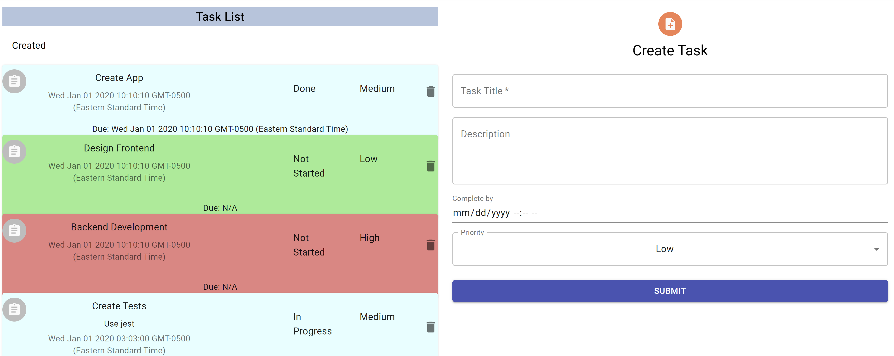

# Facere Album— To-Do List Project 


            <p><i>Predicted Energy (kJ/mol) vs EMT Energy (kJ/mol)</i></p></div>

## Description
This application is designed to allow users to create, update, and delete tasks from their task board. The application keeps track of the status of the task and the time of creation and expected completion. The user can submit information to create a task, adjust the status of it as they progress, and check if they are on track to complete it on time.

## Usage
To run the application:
- Setup a SQL server to host the database for the application
- Run `npm install` in both current directory and `./client`
- Run `npm main.js` for the Node Express API server
- Run `npm start` in `./client` for the React frontend

## Packages
- nodemon
- body-parser
- cors
- env-cmd
- express
- mysql2
- react
- material ui

## Sample Code
Submit a new task to the server through API request

```js
const dataParams = Object.keys(data).map((key) => {
    return encodeURIComponent(key) + '=' + encodeURIComponent(data[key]);
  }).join('&');
fetch('http://localhost:3001/api', {
    method: 'post',
    headers: headers,
    body: dataParams,
}).then(response => console.log(response.json()))
    .catch(err => console.error(err))
```
